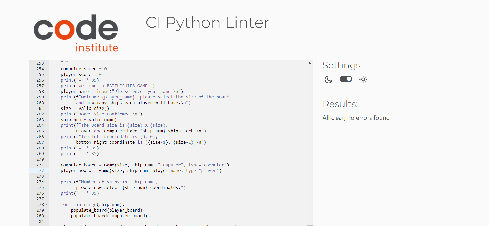

# Battleships Game

This is a terminal based battleships game.

In this version users will try to beat the computer by sinking all of their ships before 
their ships are sunk.

A live link of the game can be found [here](https://battleships-p3-5cbef4e0df20.herokuapp.com/)

## Gameplay
+ Player enters their name into the terminal.
+ Player is then asked to enter a board size and a number of ships.
+ Player can then choose row and column coordinates for the number of ships they have selected.
+ Both boards are then printed, the players chosen coordinates will appear as `@`, computers coordinates will not be visible.
+ As players makes guesses on the board they are displayed as `X`, when a ship is hit and subsequently sank it is displayed as `*`.
+ Between every round of play the player has the option to either continue the game or exit. 
+ If the player chooses to continue each time, the game proceeds until a sides ships are completely sunk.
+ Whoever sinks all their opponents boats first wins

## Features

### Existing Features

#### Board Size
+ Players can set the size of the board to modify the level of difficulty slightly.
+ Board size can be betwen 4 and 8.

#### Number of Ships
+ Players can select the number of ships in the game to also modify the level of difficulty
+ Number of ships can be between 2 and 6.

#### Ship Placement
+ Once the player has selected the number of ships and the size of the board, they can select where they place their ships on the board

#### Input Validation
+ Check if input is valid, makes sure board size and number of ships is within predefined ranges, makes sure ship placement and guesses are on the board, make sure ships placement or guess has not already been selected.
+ If an input is invalid, a relevant error message is returned and the user is asked to make another attempt in data entry.
+ If the entry is valid, it will be accepted and used in functions in the game.

### Future Features 

#### Original Game Features/Mechanics
+ The original battleships game has 5 different ships with varying sizes (Aircraft carrier, 
  battleship, cruiser, submariner and + destroyer).
+ The game is played on a 10 * 10 grid and requires all coordinates of a ship to be hit before it 
  sinks. When a player hits a ship, the opponent must announce "Hit", when all the coordinates have been hit the opponent must announce "Hit and sank".

#### Multiplayer Game Mode
+ Initial message would allow player to choose between playing a computer and player.
+ Size and ship number would still be chosen by player. 
+ Ships coordinates would both be randomly generated
+ Both boards would not display ships so that the game can be played.

## Data Model
+ I created a class called Game as my data model. This will allow us to store all relevant 
  information relating to the game on it. The relevant information stored in this class was size, board, the number of ships, player’s name,  player type (User or Computer), player guesses, computer guesses, and the coordinates of ships that have been chosen.
+ This class also has functions within it to print the board, add ships to the board, and add 
  guesses.
+ All other functions within the game rely on these class functions.

## Testing

### Bugs

#### Solved Bugs

##### Valid Coorindates Function
+ When first creating the function `valid_coordinates()` I duplicated the check for coordinates that had already been entered.
+ I used an `if` check looking throught the guessses list and then another `if ` check looking through the ships.
+ This was providing false Falses as some of the guesses were valid but in the ships list so would return falses.
+ I could avoid this error going forward by planning out functions more methodically. 

##### Game Class, player_guesses and computer_guesses
+ Originally I had used a single guess list to keep record of the user and the computer's guesses.
+ This raised an error, as I found the guess function appended incorrect guesses into this list and 
  I couldn't distinguish between player and computer guesses.
+ To remediate this error I created seperate guess lists, one for player and one for computer 

#### Unsolved Bugs
+ No unsolved bugs remaining

#### Manual Testing

###### Testing Inputs
+ I gave a range of valid and invalid inputs for size, number of ships, ship placement coordinates,
ship guess coordinates.
+ The invalid inputs were duplicate coordinates, out of range guesses or placements or inputs that were not integers.

###### Testing Lists
+ I used print statements to check that the information I wanted was being appended correctly to lists.
+ Most functions in this terminal based game relied on lists.

##### Validator Testing
+ I used Code Institute's Pep8 validator and received no errors

##### Terminal Based Testing
+ I tested the game on the coding terminal
+ I tested the game on the Heroku Terminal

## Deployment
As this project was using the backend language of Python, I needed to use Heroku to deploy a mock terminal.

I followed Code Institutes Python essentials tutorial to deploy it using the following steps.

+ On the main page of Heroku, select Create a new app
+ Under the settings section, I named my app and selected my region.
+ Following this, in the setting section I chose python and nodejs as my buildpacks in the order mentioned below:
1. Python
2. Nodejs
+ As this project did not use APIs or External packages I did not need to Config Vars.
+ Under the deployment tab I chose GitHub as the deployment method.
+ I then signed in and connected my GitHub Account.
+ Then I selected manual deploy.

## Credits

+ Heroku and Code Institute for their deployment terminal
+ Code Institute's Ultimate Battleship Game for the main board class and function breakdowns.
+ [Stack Overflow Post](https://stackoverflow.com/questions/5615648/how-can-i-call-a-function-within-a-class) for calling functions within classes